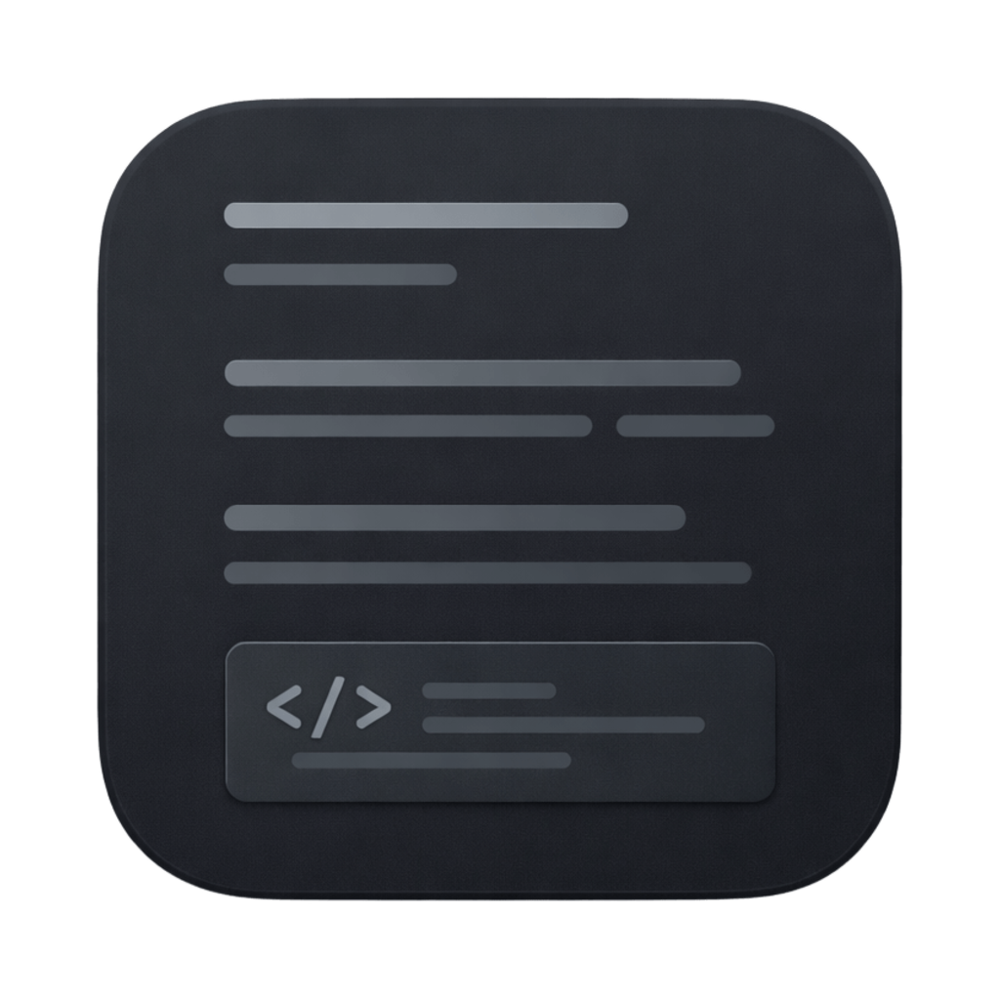
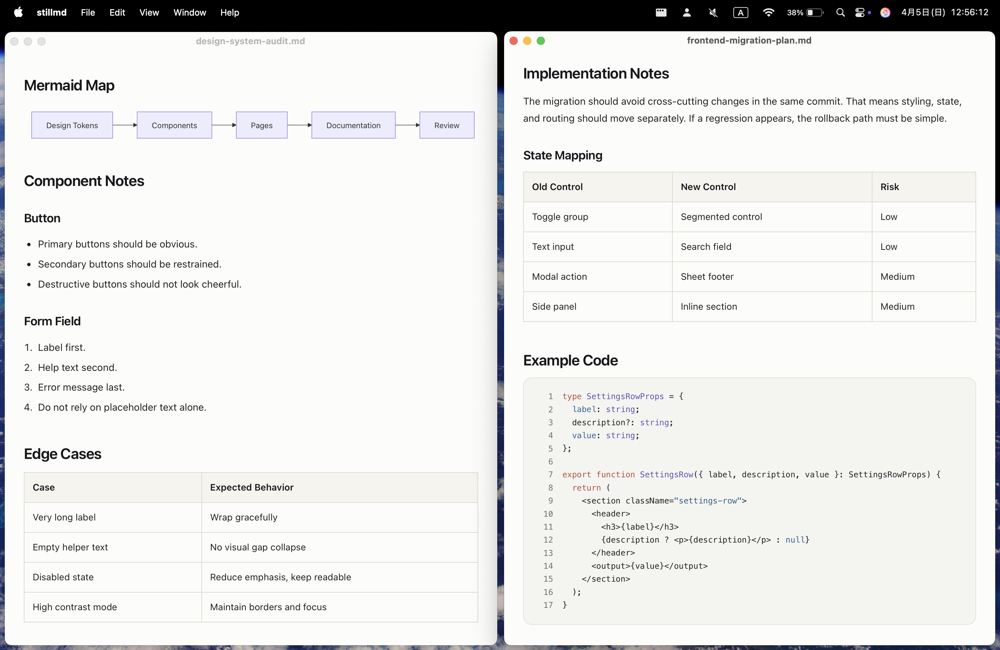

# stillmd

  

A quiet, preview-only Markdown viewer for macOS.

  <picture>
    <source media="(prefers-color-scheme: dark)" srcset="assets/example-image/stillmd-image-dark.png">
    
  </picture>

stillmd is built for reading Markdown, not managing it. It opens local `.md` and `.markdown` files, follows changes on disk, and stays out of the way.

## What it does

- Opens `.md` and `.markdown` files
- Renders GitHub Flavored Markdown, Mermaid, and fenced code blocks
- Resolves relative images and links
- Auto-reloads when the file changes, preserves scroll position, and supports `⌘F`, theme override, and text scale

## What it is not

- Not a text editor
- Not a workspace app
- Not a replacement for VS Code, Zed, or Typora

## Install

- macOS 15 or later
- Xcode 16 or later for local builds

1. Download the latest `stillmd-<version>-macos.zip` from [Releases](https://github.com/Jtwulf/stillmd/releases).
2. Unzip the archive.
3. Move `stillmd.app` into `/Applications` or another folder you prefer.

The app is distributed without Developer ID signing or notarization.

## License

stillmd is released under the [MIT License](LICENSE). Bundled third-party assets are documented in [THIRD_PARTY_NOTICES.md](THIRD_PARTY_NOTICES.md).
