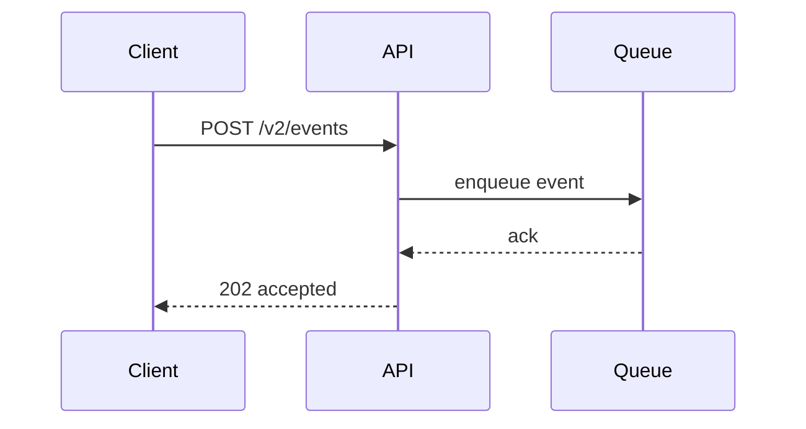

# API Rollout Plan

## Summary

This mock plan describes a fictional API rollout for a web product.
The objective is to show tables, inline code, links, fenced code blocks, and a Mermaid sequence diagram.

## Release Goals

- Introduce a versioned `POST /v2/events` endpoint.
- Keep `GET /v1/events` available during the transition.
- Make errors predictable and machine-readable.
- Document the migration path for client teams.

## Endpoints

| Method | Path | Purpose | Status |
| --- | --- | --- | --- |
| GET | `/v1/events` | Legacy read path | Deprecated |
| POST | `/v2/events` | New write path | Planned |
| GET | `/v2/events/:id` | Fetch one event | Planned |
| DELETE | `/v2/events/:id` | Cancel an event | Planned |

> Compatibility is a promise, not a suggestion.

## Request Contract

```json
{
  "type": "event.created",
  "source": "dashboard",
  "payload": {
    "userId": "u_123",
    "plan": "pro",
    "timestamp": "2026-04-05T09:00:00Z"
  }
}
```

## Response Contract

```json
{
  "id": "evt_456",
  "status": "accepted",
  "receivedAt": "2026-04-05T09:00:01Z",
  "links": {
    "self": "/v2/events/evt_456"
  }
}
```

## Mermaid Diagram



## Rollout Steps

1. Add request validation.
2. Emit structured logs.
3. Enable dual writes.
4. Compare old and new counts.
5. Flip the default client path.
6. Retire the legacy endpoint.

## Test Matrix

- [ ] Valid payload returns `202`
- [ ] Missing `type` returns `400`
- [ ] Invalid JSON returns `400`
- [ ] Duplicate submission returns `409`
- [ ] Unauthorized request returns `401`
- [ ] Oversized payload returns `413`
- [ ] Slow downstream queue returns `503`

## Example Curl

```bash
curl -X POST "https://api.example.test/v2/events" \
  -H "Content-Type: application/json" \
  -H "Idempotency-Key: demo-001" \
  -d '{
    "type": "event.created",
    "source": "dashboard",
    "payload": {
      "userId": "u_123",
      "plan": "pro"
    }
  }'
```

## Notes on Error Handling

- Return stable `code` values.
- Keep human-readable `message` fields short.
- Attach `requestId` to every failure.
- Avoid leaking internal stack traces.

## Example Error

```json
{
  "error": {
    "code": "payload_invalid",
    "message": "payload.plan is required",
    "requestId": "req_abc"
  }
}
```

## Operational Checklist

- [ ] Publish migration docs
- [ ] Notify client owners
- [ ] Watch latency for 48 hours
- [ ] Verify queue depth stays stable
- [ ] Compare error rates by version
- [ ] Confirm rollback is one config change

## Suggested Tables

| Metric | Threshold | Action |
| --- | --- | --- |
| p95 latency | Under 300ms | Keep rollout going |
| 4xx rate | Under 2% | Investigate client bugs |
| 5xx rate | Under 0.5% | Pause rollout |
| queue lag | Under 30s | Continue |

## Links

- https://example.com/docs/api
- https://example.com/status
- https://example.com/changelog

