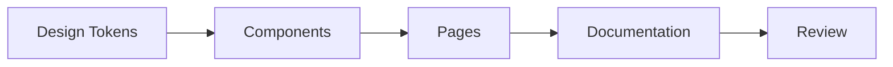

# Design System Audit

## Purpose

This file is a mock review of a design system refresh.
It is meant to show how tables, task lists, quotes, code blocks, and headings render in a preview.

## Design Principles

1. Typography should be calm.
2. Spacing should be consistent.
3. Color should support hierarchy, not compete with it.
4. Motion should be brief.
5. Components should be reusable without becoming generic.

## Token Inventory

| Token | Example | Notes |
| --- | --- | --- |
| `space-1` | `4px` | Smallest spacing unit |
| `space-4` | `16px` | Default block spacing |
| `radius-2` | `8px` | Used for cards and inputs |
| `text-muted` | `#667085` | Secondary text color |
| `border-subtle` | `#D0D5DD` | Thin dividers |

> A token system is useful only if the team can actually remember it.

## Audit Checklist

- [ ] Verify headings use a readable scale
- [ ] Verify links remain obvious
- [ ] Verify code samples are distinguishable
- [ ] Verify tables do not overflow
- [ ] Verify states are not color-only
- [ ] Verify focus rings are visible

## Example CSS

```css
.card {
  border: 1px solid var(--border-subtle);
  border-radius: 12px;
  padding: 16px;
  background: var(--surface);
  color: var(--text-primary);
}

.card h2 {
  margin: 0 0 8px;
  font-size: 1.125rem;
}
```

## Mermaid Map



## Component Notes

### Button

- Primary buttons should be obvious.
- Secondary buttons should be restrained.
- Destructive buttons should not look cheerful.

### Form Field

1. Label first.
2. Help text second.
3. Error message last.
4. Do not rely on placeholder text alone.

## Edge Cases

| Case | Expected Behavior |
| --- | --- |
| Very long label | Wrap gracefully |
| Empty helper text | No visual gap collapse |
| Disabled state | Reduce emphasis, keep readable |
| High contrast mode | Maintain borders and focus |

## Example Markup

```html
<section class="audit-note">
  <h3>Spacing Review</h3>
  <p>The sidebar uses the same outer rhythm as the content area.</p>
  <ul>
    <li>Aligned to an 8px grid</li>
    <li>Preserves readable line length</li>
    <li>Avoids dense stacked controls</li>
  </ul>
</section>
```

## Review Questions

- Is the primary action clearly visible?
- Are links underlined when needed?
- Does the table still read well on a small screen?
- Can a keyboard user understand the current state?

## Example Callout

> Note: if a component needs three shadows to feel important, it probably is not important.

## Open Items

- Revisit the neutral palette.
- Verify the spacing scale against the app shell.
- Replace ambiguous icons.
- Document the fallback font stack.

## Completion Criteria

- [ ] Token names are documented
- [ ] Component examples are updated
- [ ] Accessibility checks pass
- [ ] No layout regressions appear in the preview

