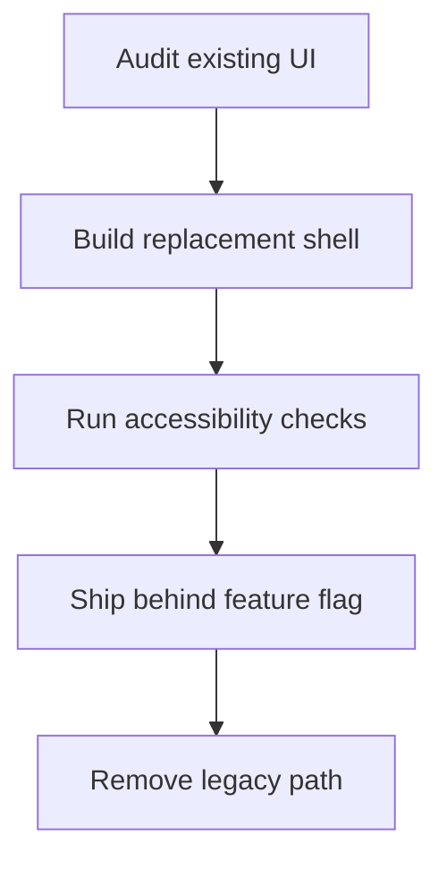

# Frontend Migration Plan

## Executive Summary

This document is a mock implementation plan for a web application migration.
It is intentionally verbose so that a Markdown preview can show headings, tables, lists, code, and diagrams.
The content is fictional.

## Goals

- Migrate the settings experience to a new component system.
- Keep the release train stable while the new UI ships behind a flag.
- Preserve existing keyboard shortcuts.
- Maintain parity across desktop and mobile breakpoints.
- Reduce layout shift in the primary navigation.

## Non-Goals

- Rewriting the routing layer.
- Replacing the entire design system.
- Adding a new analytics vendor.
- Building a rich text editor.

> The safest migration is the one users do not notice until it is already finished.

## Current State

| Area | Status | Notes |
| --- | --- | --- |
| Navigation shell | Stable | Needs spacing cleanup |
| Settings panel | Legacy | Uses mixed patterns |
| Accessibility labels | Partial | Missing a few controls |
| Preview rendering | Stable | No changes planned |
| Release process | Manual | Requires one final review |

## Proposed Phases

### Phase 1: Audit

1. Inventory all settings entry points.
2. Map each control to its owner.
3. Record any hidden coupling.
4. Identify the top three regressions to avoid.

### Phase 2: Component Swap

- Replace the legacy shell with the new layout primitive.
- Preserve focus order.
- Keep all shortcuts intact.
- Confirm scroll behavior is unchanged.

### Phase 3: Validation

- [ ] Verify keyboard navigation
- [ ] Verify screen reader labels
- [ ] Verify light theme
- [ ] Verify dark theme
- [ ] Verify narrow viewport
- [ ] Verify large viewport
- [ ] Verify no overflow in long labels

## Mermaid Flow



## Implementation Notes

The migration should avoid cross-cutting changes in the same commit.
That means styling, state, and routing should move separately.
If a regression appears, the rollback path must be simple.

### State Mapping

| Old Control | New Control | Risk |
| --- | --- | --- |
| Toggle group | Segmented control | Low |
| Text input | Search field | Low |
| Modal action | Sheet footer | Medium |
| Side panel | Inline section | Medium |

## Example Code

```tsx
type SettingsRowProps = {
  label: string;
  description?: string;
  value: string;
};

export function SettingsRow({ label, description, value }: SettingsRowProps) {
  return (
    <section className="settings-row">
      <header>
        <h3>{label}</h3>
        {description ? <p>{description}</p> : null}
      </header>
      <output>{value}</output>
    </section>
  );
}
```

## Risks

1. Focus traps may appear during the transition.
2. Tests may pass while visual spacing still regresses.
3. Feature flags may hide a broken branch too long.
4. The old layout may survive in a forgotten route.

## Acceptance Criteria

- The new shell renders without visual jitter.
- The old shell remains available during rollout.
- The preview remains readable at all supported widths.
- No new warnings are introduced in the build.
- The team can explain the rollback path in one sentence.

## Verification Checklist

- [ ] Open the settings screen from the command palette
- [ ] Tab through every interactive control
- [ ] Confirm the heading hierarchy is correct
- [ ] Inspect the DOM for duplicate landmarks
- [ ] Compare screenshots before and after
- [ ] Remove the feature flag only after sign-off
- [ ] Update the release note draft

## Appendix

References:

- https://developer.mozilla.org/
- https://www.w3.org/WAI/
- https://react.dev/

