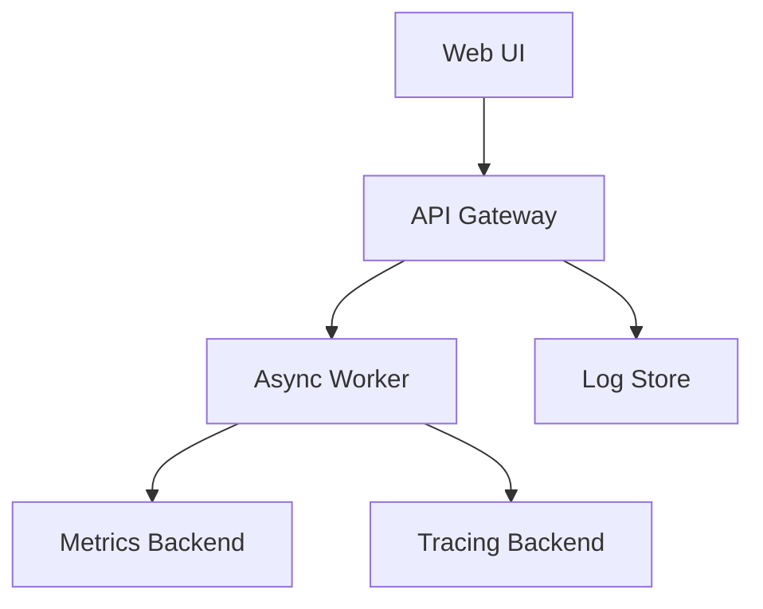

# Observability Plan

## Overview

This fictional plan describes how a product team would instrument a new feature.
It is designed to demonstrate structured lists, code blocks, tables, and diagrams in Markdown preview.

## What We Want to See

- Metrics for request volume and latency.
- Logs for failures and retries.
- Traces for cross-service hops.
- Alerts for customer-visible regressions.

## System Map



## Signals

| Signal | Example | Why It Matters |
| --- | --- | --- |
| Request count | `http_requests_total` | Shows adoption |
| Error rate | `http_request_errors_total` | Reveals breakage |
| Latency | `http_request_duration_ms` | Indicates user pain |
| Retry count | `job_retries_total` | Reveals downstream instability |

> If the alert cannot tell you what changed, it is not helping.

## Logging Example

```json
{
  "level": "warn",
  "event": "job.retry",
  "jobId": "job_009",
  "attempt": 3,
  "reason": "timeout",
  "requestId": "req_42"
}
```

## Tracing Example

```text
root span
  -> auth span
  -> queue span
  -> worker span
  -> notification span
```

## Alerting Plan

1. Measure the baseline for seven days.
2. Set alerts only after the baseline is stable.
3. Use page-worthy alerts sparingly.
4. Route noisy alerts to a digest first.

## Action Items

- [ ] Add request IDs to every API response
- [ ] Record retry metadata in structured logs
- [ ] Emit timing around all external calls
- [ ] Add dashboard filters by environment
- [ ] Review alert thresholds with support

## Example Query

```sql
SELECT
  service_name,
  count(*) AS errors
FROM request_logs
WHERE level = 'error'
  AND created_at >= now() - interval '24 hours'
GROUP BY service_name
ORDER BY errors DESC;
```

## Incident Notes

The first response should answer three questions:

1. What broke?
2. Who is affected?
3. How do we reduce the blast radius?

## Rollout Checks

- [ ] Compare metrics before and after release
- [ ] Confirm log volume does not explode
- [ ] Verify dashboards still load quickly
- [ ] Check that trace sampling is not too low
- [ ] Make sure alert text is understandable

## Sample Postmortem Outline

### Timeline

- Detection at 09:12
- Mitigation at 09:18
- Root cause identified at 09:40
- Fix deployed at 10:05

### Follow-ups

- Add a missing alert.
- Tighten a retry policy.
- Document the fallback path.

## Reference Links

- https://opentelemetry.io/
- https://prometheus.io/
- https://grafana.com/

