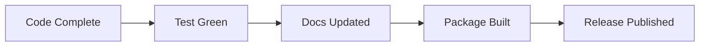

# Release Readiness Checklist

## Goal

This mock document shows a release checklist for a software team.
It includes headings, checklists, tables, quotes, code blocks, and a Mermaid diagram.

## Release Criteria

- Build artifacts are reproducible.
- Test coverage is acceptable.
- Documentation is current.
- Rollback steps are written down.
- The team knows who approves the release.

## Pipeline



## Checklist

- [ ] Update the version number
- [ ] Refresh the changelog
- [ ] Rebuild the app or package
- [ ] Run the full test suite
- [ ] Verify the install instructions
- [ ] Confirm download links work
- [ ] Draft release notes
- [ ] Share the announcement internally

> A release without a rollback plan is not finished.

## Version Table

| File | Purpose | Updated |
| --- | --- | --- |
| `package.json` | Version metadata | Pending |
| `CHANGELOG.md` | User-facing summary | Pending |
| `README.md` | Installation notes | Pending |
| `RELEASE_NOTES.md` | Release announcement | Pending |

## Packaging Script

```bash
#!/usr/bin/env bash
set -euo pipefail

echo "Building release package..."
echo "Running tests..."
echo "Creating archive..."
echo "Done."
```

## Validation Matrix

| Platform | Install | Launch | Notes |
| --- | --- | --- | --- |
| macOS 15 | Yes | Yes | Primary target |
| macOS 14 | Maybe | Maybe | Best effort |
| Clean machine | Yes | Yes | Validates dependencies |

## Launch Notes

1. Open the app once.
2. Confirm it finds the expected file.
3. Confirm the preview renders text, code, and diagrams.
4. Confirm recent changes did not break window restoration.

## Communication Plan

- Tell support when the release begins.
- Tell engineering when the artifact is published.
- Tell stakeholders when the rollout is complete.
- Tell nobody that the version is "basically done" until checks pass.

## Incident Rollback

If a problem appears:

1. Disable the release channel.
2. Restore the previous package.
3. Publish a short status update.
4. Reproduce the failure locally.
5. Patch the root cause.

## Additional Checks

- [ ] Verify links in the README
- [ ] Verify screenshots are current
- [ ] Verify license files are present
- [ ] Verify third-party notices are included
- [ ] Verify the support email still works
- [ ] Verify the changelog matches the tag

## Example Release Note

```md
## 1.8.0

This release adds a quieter preview shell, improves code block spacing,
and tightens rendering for large documents.
```

## Final Gate

- [ ] All checklist items are complete
- [ ] The artifact hash is recorded
- [ ] The team has reviewed the notes
- [ ] The release is ready to publish

